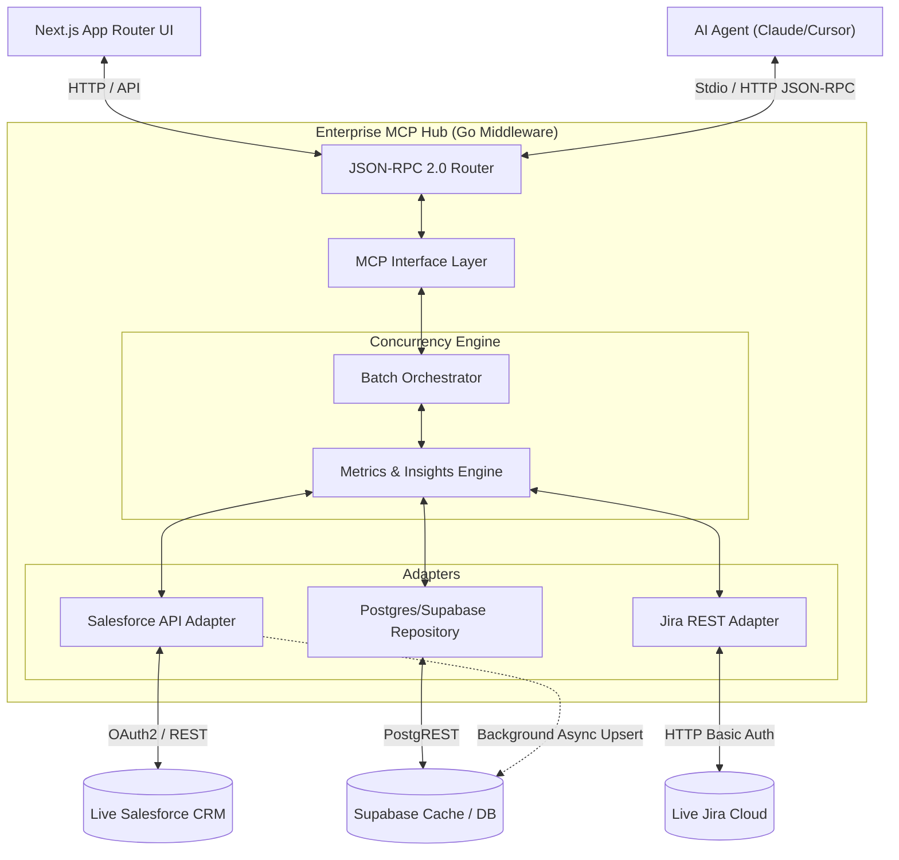
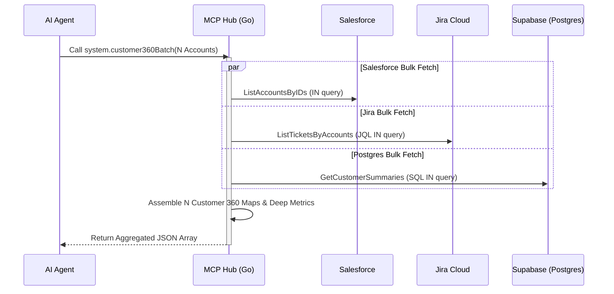
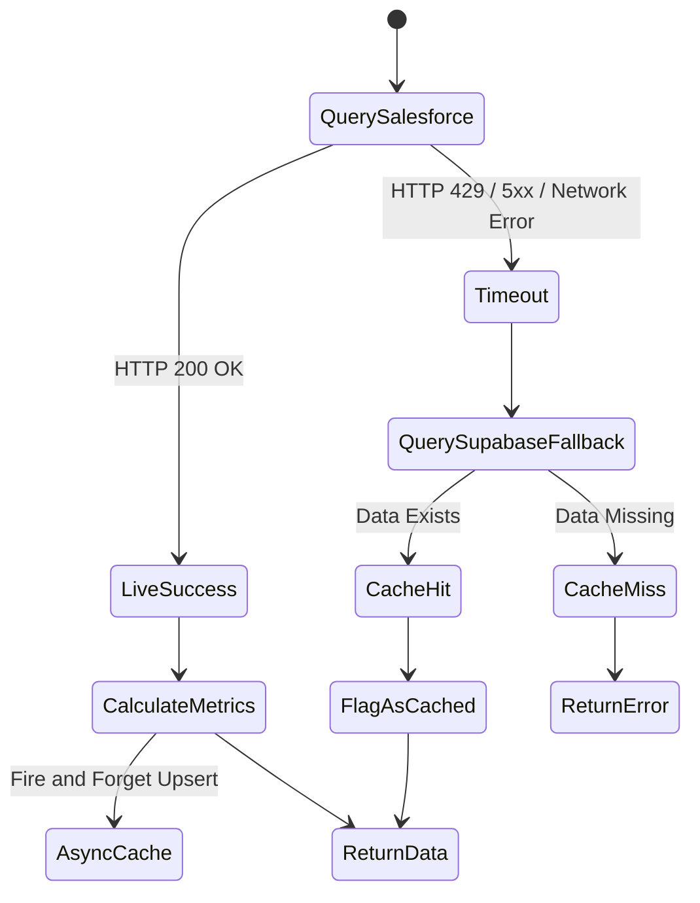

# Enterprise MCP Hub & Customer 360

A distributed architecture integrating Go, Next.js, and the Model Context Protocol (MCP) to unify enterprise data sources (Salesforce, Jira, PostgreSQL) into a highly available, concurrent middleware layer.

## System Topology

The backend simultaneously serves a React frontend and a JSON-RPC 2.0 MCP interface for autonomous AI agents (Claude, Cursor). 



## Performance & N+1 Query Resolution

To prevent API exhaustion, a high-throughput **Batch Orchestrator** resolves O(N) queries into O(1) bulk operations.



## Graceful Resilience Degradation

Engineered to survive complete outages of critical infrastructure via an automated 30-minute background syncer and instant fallback caching.



## AI Capabilities (MCP Tools)

The backend acts as an intelligent abstraction layer exposing 13 tools:
- **`system.customer360Batch` & `system.customer360`**: Unified concurrency aggregation.
- **`system.getAccountInsights`**: AI analysis of churn risk.
- **`system.healthCheck`**: Backend resilience probing.
- **`salesforce.*`**: Search, List, Get Accounts.
- **`jira.*`**: List tickets, fetch trends, and escalate (`jira.escalateTicket`).
- **`sales.*`**: List orders, get summaries, adjust limits (`system.adjustApiRateLimit`).

**Connect via Stdio (Claude Desktop / Cursor):**
```json
{
  "mcpServers": {
    "enterprise-hub": {
      "command": "go",
      "args": ["run", "./cmd/server", "-mode=stdio"]
    }
  }
}
```

## Quickstart

1. **Clone**: `git clone https://github.com/ia-06/project-1-enterprise-mcp-hub.git`
2. **Config**: `cp .env.example .env` *(Set `SF_USE_MOCK=true` and `JIRA_USE_MOCK=true` to bypass live APIs)*
3. **Database**: `cd infra && docker compose up --build -d`
4. **Frontend**: `npm install && npm run dev`
5. **Verify**: Visit `http://localhost:3000`.