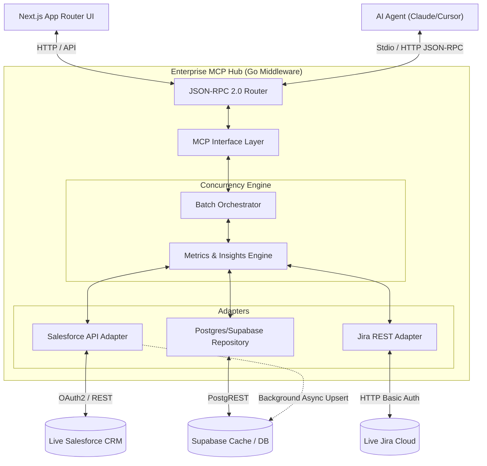
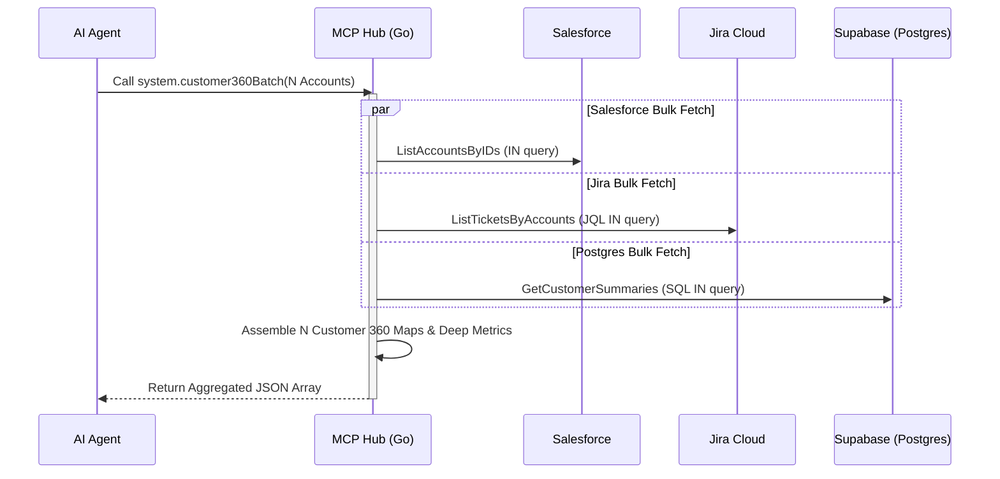
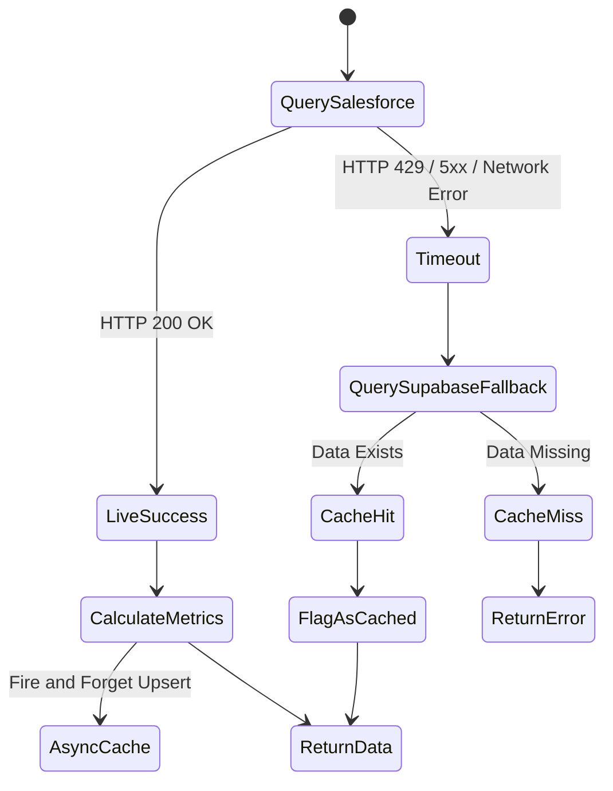

# Enterprise MCP Hub & Customer 360

A distributed architecture integrating Go, Next.js, and the Model Context Protocol (MCP) to unify enterprise data sources (Salesforce, Jira, PostgreSQL) into a highly available, concurrent middleware layer.

## Architectural Philosophy & System Design

As enterprise systems scale, AI agents need direct access to disparate data silos without experiencing N+1 query exhaustion or latency-induced timeouts. We engineered this Hub to solve these precise bottlenecks by decoupling the agent protocol from the visualization layer.

The system serves two entirely distinct pathways simultaneously:
1. **The Human-in-the-Loop Web Dashboard:** Powered by a React Next.js frontend communicating with the Go backend over standard HTTP (port `8080`).
2. **The Autonomous Agent Pathway:** Powered by the Go backend operating in a dedicated `stdio` mode, natively speaking the JSON-RPC Model Context Protocol to AI IDEs (Cursor, VS Code, Windsurf) and CLI tools (Claude Code).

*Why this design?* By separating the transport layers, we allow agents to maintain a direct, secure IPC (Inter-Process Communication) connection via `stdio`—immune to network partition errors—while human operators interact with the aggregated HTTP streams.

## System Topology

The backend simultaneously serves the React frontend and the JSON-RPC 2.0 MCP interface. 



## Performance & N+1 Query Resolution

To prevent API exhaustion across heavily rate-limited enterprise CRM APIs, we implemented a high-throughput **Batch Orchestrator** that resolves O(N) queries into O(1) bulk operations.



## Graceful Resilience Degradation

Engineered to survive complete outages of critical infrastructure via an automated 30-minute background syncer and instant fallback edge caching.



## Developer Do's and Don'ts (CRITICAL)

When integrating the MCP Server into your AI Agent (Cursor, VS Code, Windsurf, etc.), strict adherence to protocol hygiene is required.

- **DO** compile the Go binary using the provided `npm run build:mcp` (or `build-mcp.bat`/`.sh`) script.
- **DO** configure your IDE to execute the compiled binary directly.
- **DON'T** use `go run ./cmd/server` in your IDE configuration. *Why?* The Go compiler frequently emits build logs or module warnings to `stdout`. The MCP `stdio` transport relies on a perfectly pristine stdout stream; any non-JSON string will fatally corrupt the JSON-RPC handshake.
- **DON'T** run Docker if you are using a remote Supabase Postgres database. *Why?* The Docker `docker-compose.yml` is provided strictly as a local fallback container for developers without a cloud Supabase instance. If your `.env` points to a cloud database, Docker is entirely unnecessary.

## Connecting AI Agents (MCP)

To connect an AI Agent securely via the pristine STDIO transport, follow these exact steps:

1. **Compile the binary:**
   ```bash
   npm run build:mcp
   ```
2. **Configure your IDE (Cursor / VS Code / Windsurf):**
   Provide the absolute path to the compiled binary in your `mcp.json` or extension settings:
   ```json
   {
     "mcpServers": {
       "enterprise-hub": {
         "command": "absolute/path/to/project-1-enterprise-mcp-hub/mcp-server/mcp-hub.exe",
         "args": ["-mode=stdio"],
         "cwd": "absolute/path/to/project-1-enterprise-mcp-hub"
       }
     }
   }
   ```
*(Note: Replace `mcp-hub.exe` with `mcp-hub` on macOS/Linux).*

The agent will natively discover 13 tools including `system.customer360Batch`, `system.getAccountInsights`, `jira.escalateTicket`, and `system.adjustApiRateLimit`.

## Unified Quickstart

We've unified the developer experience. You no longer need multiple terminal windows.

1. **Clone & Configure:**
   ```bash
   git clone https://github.com/ia-06/project-1-enterprise-mcp-hub.git
   cp .env.example .env
   ```
   *(Set `SF_USE_MOCK=true` and `JIRA_USE_MOCK=true` to bypass live APIs)*
2. **Optional Local DB:** If you don't have a remote Supabase connection, start the local Postgres fallback:
   ```bash
   cd infra && docker compose up --build -d && cd ..
   ```
3. **Launch Unified System:**
   ```bash
   npm install
   npm run dev:all
   ```
4. **Verify:** Visit `http://localhost:3000`.